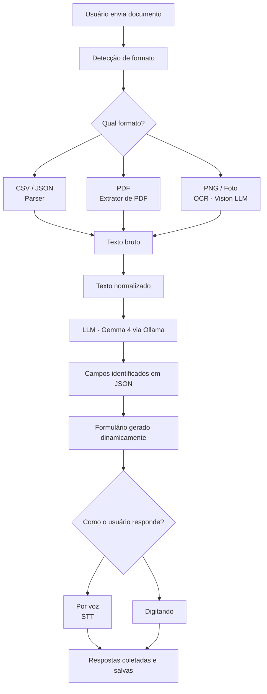

# FalaTexto PWA
### Assistente de Preenchimento de Formulário com IA

Aplicação web progressiva (PWA) que utiliza inteligência artificial para digitalizar, interpretar e preencher formulários de forma assistida — por voz ou texto.

---

## Sobre o Projeto

O FalaTexto é um assistente inteligente de formulários desenvolvido pelo **LABMET/LAPSI**. Diferente dos formulários tradicionais, o app aceita perguntas em qualquer formato — foto, PDF, CSV ou JSON — interpreta automaticamente os campos usando um modelo de IA com visão computacional, e permite que o usuário responda por **voz** ou **digitando**.

---

## Funcionalidades

- Recebe formulários em múltiplos formatos: PDF, CSV, JSON, PNG e foto
- Identifica e classifica campos automaticamente via IA (texto, número, data, booleano, múltipla escolha)
- Resposta por voz com conversão fala-para-texto (STT)
- Resposta por digitação como alternativa
- Funciona em Android, iPhone e computador com o mesmo código
- Privacidade total — os dados não saem para servidores de terceiros
- Instalável na tela inicial como app nativo

---

## Tecnologias

| Camada | Tecnologia |
|---|---|
| Frontend | Angular + PWA |
| Backend | Node.js |
| Modelo de IA | Gemma 4 via Ollama |
| Banco de dados | MongoDB ou SQLite (a definir) |
| STT (voz) | Whisper |

---

## Arquitetura

```
Usuário (qualquer dispositivo)
        ↓
   PWA Angular (frontend)
        ↓
   Backend Node.js
        ↓
   Ollama + Gemma 4 (modelo local)
```

O modelo de IA roda localmente no servidor do projeto, garantindo privacidade total dos dados processados.

---

## Fluxograma do Sistema



## Como rodar o projeto

### Pré-requisitos

- Node.js v24+ (LTS)
- Angular CLI v21+
- Ollama instalado

### Instalação e desenvolvimento

```bash
# Clone o repositório
git clone https://github.com/seu-usuario/falatexto-pwa.git
cd falatexto-pwa

# Instale as dependências
npm install

# Inicie o servidor de desenvolvimento
npm start
```

Acesse `http://localhost:4200` no navegador.

### Build de produção

```bash
npm run build
```

Os arquivos gerados ficam em `dist/falatexto-pwa/browser/`. O service worker (PWA) só é registrado no build de produção. Para testá-lo localmente:

```bash
npx http-server dist/falatexto-pwa/browser -p 8080 -c-1
```

### Testes

```bash
npm test
```

### Subindo o modelo de IA

```bash
# Baixar o modelo (necessário apenas uma vez)
ollama pull gemma4

# Iniciar o Ollama
ollama serve
```

---

## Estrutura do Projeto

```
falatexto-pwa/
├── src/
│   ├── app/
│   │   ├── core/
│   │   │   ├── guards/       ← authGuard (proteção de rotas)
│   │   │   ├── models/       ← interfaces Form, User
│   │   │   └── services/     ← AuthService, FormService, StorageService
│   │   ├── features/
│   │   │   ├── onboarding/   ← tela inicial
│   │   │   ├── login/        ← autenticação por PIN
│   │   │   ├── dashboard/    ← listagem e busca de formulários
│   │   │   └── create-form/  ← criação de novo formulário
│   │   ├── shared/
│   │   │   ├── animations/   ← animações Angular (fadeIn, staggerFade…)
│   │   │   └── components/   ← pin-input, button, card, input
│   │   └── app.routes.ts     ← rotas com lazy loading
│   ├── index.html
│   └── main.ts
├── public/
│   └── icons/                ← ícones do PWA
├── ngsw-config.json          ← configuração do service worker
└── package.json
```

---

## Equipe

Projeto desenvolvido no âmbito do **LABMET/LAPSI**.

---
