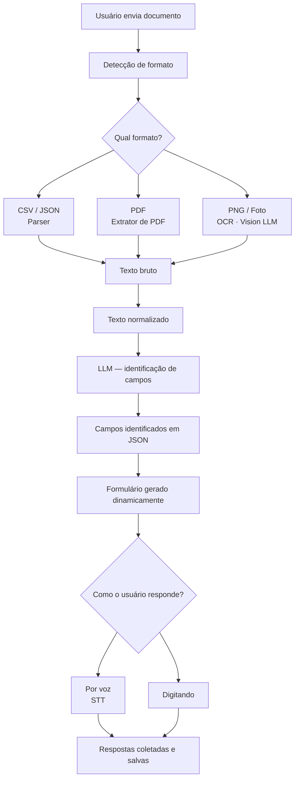

# Fala-Texto PWA
### Assistente Inteligente de Preenchimento de Formulários

Aplicação web progressiva (PWA) que utiliza inteligência artificial para digitalizar, interpretar e preencher formulários de forma assistida — por voz ou texto.

---

## Sobre o Projeto

O Fala-Texto é um assistente inteligente de formulários desenvolvido pelo **LABMET/LAPSI — UFCG/HUAC**. O app aceita formulários em qualquer formato — foto, PDF, CSV ou JSON — interpreta automaticamente os campos usando IA com visão computacional, e permite que o usuário responda por **voz** ou **digitando**.

---

## Funcionalidades

- Recebe formulários em múltiplos formatos: PDF, CSV, JSON, imagem e foto manuscrita
- Identifica e classifica campos automaticamente via IA
- Resposta por voz com conversão fala-para-texto (STT) — em desenvolvimento
- Resposta por digitação
- Funciona em Android, iPhone e computador com o mesmo código
- Instalável na tela inicial como app nativo (PWA)
- Suporte a múltiplos idiomas: português, inglês e espanhol

---

## Tecnologias

| Camada | Tecnologia |
|---|---|
| Frontend | Angular 21 + PWA |
| Backend | FastAPI (Python) |
| Banco de dados | MongoDB |
| Infraestrutura | Docker + Docker Compose |
| STT (voz) | Whisper — em desenvolvimento |

---

## Arquitetura

```
Usuário (qualquer dispositivo)
        ↓
   PWA Angular — porta 4200 (frontend)
        ↓
   FastAPI — porta 8000 (backend)
        ↓
   MongoDB (banco de dados)
```

---

## Fluxograma do Sistema



---

## Como rodar o Frontend

### Pré-requisitos

- Node.js v24+ (LTS)
- Angular CLI v21+

Se não tiver o Node.js instalado:

```bash
# Instalar o nvm
curl -o- https://raw.githubusercontent.com/nvm-sh/nvm/v0.39.0/install.sh | bash

# Instalar o Node.js
nvm install 24
```

Se não tiver o Angular CLI instalado:

```bash
npm install -g @angular/cli
```

### Passo a passo

```bash
# 1. Clonar o repositório
git clone https://github.com/Projetos-Lapsi-UFCG/falatexto-pwa.git
cd falatexto-pwa

# 2. Mudar para a branch do frontend
git checkout feature/ui-template

# 3. Instalar as dependências
npm install --legacy-peer-deps

# 4. Rodar o app
ng serve -o
```

O app abre automaticamente em `http://localhost:4200`.

### Configuração de runtime (`config.js`)

O token do Vision e o PIN de administrador **não** são embutidos no bundle. Eles são
lidos de `window.__APP_CONFIG__`, definido por `/config.js`:

- **Dev (`ng serve` / `ng build`):** usa `public/config.js`, com valores padrão de
  desenvolvimento (`0000`).
- **Container:** o `docker-entrypoint.sh` regenera `/config.js` na inicialização a
  partir das variáveis de ambiente `VISION_API_SECRET_TOKEN` e `ADMIN_PIN` (ver
  `.env.example` na raiz do repositório). Rotacionar um segredo não exige rebuild.

### Build de produção

```bash
ng build
```

Os arquivos gerados ficam em `dist/falatexto-pwa/browser/`.

---

## Estrutura do Frontend

```
falatexto-pwa/
├── public/
│   ├── i18n/              → traduções (pt-BR.json, en.json, es.json)
│   ├── icons/             → ícones do PWA e logo do app
│   ├── favicon.ico
│   └── manifest.webmanifest
├── src/
│   └── app/
│       ├── core/
│       │   ├── config/
│       │   │   ├── api.config.ts       → base URL da API
│       │   │   └── runtime-config.ts   → lê /config.js (token do Vision, PIN de admin) injetado no runtime
│       │   ├── guards/
│       │   │   ├── auth.guard.ts       → protege rotas que exigem login
│       │   │   └── admin.guard.ts      → protege rotas restritas a administradores
│       │   ├── models/
│       │   │   ├── form.model.ts       → interfaces Form, Section, QuestionField, FieldOption
│       │   │   └── user.model.ts       → interface User e tipo UserType
│       │   └── services/
│       │       ├── auth.service.ts     → login/logout; admin exige o PIN de ADMIN_PIN, guest aceita qualquer PIN de 4 dígitos
│       │       ├── form.service.ts     → gerencia formulários pré-instalados e criados pelo usuário
│       │       ├── language.service.ts → controla o idioma da interface
│       │       ├── storage.service.ts  → salva e lê dados no dispositivo (localStorage)
│       │       └── submission.ts       → requisições HTTP para o backend
│       ├── features/
│       │   ├── onboarding/             → tela inicial com carrossel de funcionalidades
│       │   ├── login/                  → autenticação por tipo de usuário e PIN (admin: PIN de ADMIN_PIN)
│       │   ├── dashboard/              → listagem e busca de formulários
│       │   ├── create-form/            → criação de novo formulário com validação em tempo real
│       │   ├── form-detail/            → detalhes de um formulário específico
│       │   └── form-fill/              → preenchimento do formulário em etapas
│       └── shared/
│           ├── animations/             → animações de transição entre telas
│           └── components/             → componentes reutilizáveis (pin-input, card, button, etc.)
├── app.routes.ts                       → rotas do app com lazy loading
├── app.config.ts                       → configuração global do Angular
└── styles.css                          → estilos globais e variáveis de cor
```

### Rotas disponíveis

| Rota | Tela | Protegida por login? |
|---|---|---|
| `/` | Onboarding | ❌ |
| `/login` | Login | ❌ |
| `/dashboard` | Dashboard | ✅ |
| `/create` | Criar formulário | ✅ |
| `/forms/:id` | Detalhes do formulário | ✅ |
| `/forms/:id/fill` | Preenchimento do formulário | ✅ |

---

## Formulários pré-instalados

O app já vem com três formulários de exemplo:

| Nome | Entidade | Tipo |
|---|---|---|
| Cirurgia Segura | HUAC | Template |
| Triagem | UBS | Template |
| Avaliação Cardiovascular | Hospital do Coração | Manual |

---

## Requisições HTTP para o Backend

O frontend está preparado para se comunicar com o backend na porta 8000. As seguintes rotas precisam estar implementadas no backend:

| Método | Rota | Descrição |
|---|---|---|
| GET | `/api/forms` | Retorna lista de formulários |
| GET | `/api/forms/:id` | Retorna um formulário pelo id |
| POST | `/api/submissions` | Recebe e salva respostas preenchidas |

---

## Equipe

Projeto desenvolvido no âmbito do **LABMET/LAPSI — UFCG/HUAC**.
